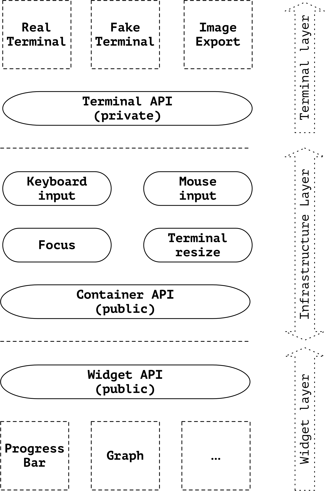

# Terminal Dashboard High-Level Design

## Objective

Develop infrastructure of dashboard widgets. The widgets should support both
input (mouse and keyboard) and output (display of information to the user).

Fulfill the requirements outlined in the main
[README](http://github.com/mum4k/termdash).

## Background

The terminal dashboard allows placement of configurable widgets onto the terminal.

A widget displays some information to the user, e.g. A graph, a chart, a
progress bar. A widget can receive information from the user in the form of
events, e.g. Mouse or keyboard input.

The widgets aren't placed onto the terminal directly, instead the terminal is
organized into containers. Each container can contain either a widget or
other containers.

## Overview

The terminal dashboard consists of the following layers:

- Display.
- Infrastructure.
- Widgets.

The **display layer** abstracts the display implementation. A real terminal
implementation is used in production when displaying on the terminal. A fake
terminal implementation is used in widget unit tests and system tests. Other
implementations are possible, e.g. Image export. The display layer is private,
neither the users of this library nor the widgets interact with the display
directly.

The **infrastructure layer** is responsible for container management, tracking
of keyboard and mouse focus and handling external events like resizing of the
display. The infrastructure layer also decides when to flush the buffer and
refresh the screen. I.e. The widgets update content of a back buffer and the
infrastructure decides when it is synchronized to the display.

The **widgets layer** contains the implementations of individual widgets. Each
widget receives a canvas from the container on which it presents its content to
the user. Widgets indicate to the infrastructure layer if they support input
events, which are then forwarded from the infrastructure layer.

The user interacts with the widget API when constructing individual widgets and
with the container API when placing the widgets onto the dashboard.



## Detailed design

### Display

### Infrastructure

### Widgets

## APIs

### Display API

The Display API is an interface private to the terminal dashboard library. Its
primary purpose is to act as a shim layer over different display
implementations.

The API allows to:

- Set values and attributes of cells on a back buffer representing a 2-D
  canvas.
- Flush the content of the back buffer to the output.
- Manipulate the cursor position and visibility.
- Read input events (keyboard, mouse, display resize, etc...).

The following outlines the display API:

```go
// Display abstracts an implementation of a 2-D display.
// A display consists of a number of cells.
type Display interface {
  // Size returns the display width and height in cells.
  Size() image.Point

  // Clear clears the content of the internal back buffer, resetting all cells
  // to their default content and attributes.
  Clear() error
  // Flush flushes the internal back buffer to the display.
  Flush() error

  // SetCursor sets the position of the cursor.
  SetCursor(p image.Point)
  // HideCursos hides the cursor.
  HideCursor()

  // SetCell sets the value of the specified cell to the provided rune.
  // Use the options to specify which attributes to modify, if an attribute
  // option isn't specified, the attribute retains its previous value.
  SetCell(p image.Point, r rune, opts ...CellOption)

  // Event waits for the next event and returns it.
  // This call blocks until the next event or cancellation of the context.
  Event(ctx context.Context) Event
}
```

The **Event()** method returns the next input event. Different input event
types are defined as follows.

```
// Event represents an input event.
type Event interface {
  isEvent()
}

// Keyboard is the event used when a key is pressed.
// Implements Event.
type Keyboard struct {
  // Key identifies the pressed key.
  Key rune
}

func (*Keyboard) isEvent() {}

// DisplayResize is the event used when the display was resized.
// Implements Event.
type DisplayResize struct {
  // Size is the new size of the display.
  Size image.Point
}

func (*DisplayResize) isEvent() {}

// Mouse is the event used when the mouse is moved or a mouse button is
// pressed.
// Implements Event.
type Mouse struct {
  // Position of the mouse on the display.
  Position() image.Point
  // Button identifies the pressed button if any.
  Button MouseButton
}

func (*Mouse) isEvent() {}
```

### Container API

### Widget API

## Project information

## Caveats

## Testing plan

## Work estimates

## Future improvements

## Document history

Date        | Author | Description
------------|--------|---------------
24-Mar-2018 | mum4k  | Initial draft.

## Notes (work in progress)

- container styling, borders.
- coordinates translation for widgets.
- library to parse events and identify known keyboard shortcuts.
- widget API (creation, options, updating displayed status, reading inputs).
- infra API for widgets.
- widget registration options (subscribe to input / events).
- testing framework (fake display and test helper functions).
- container and splits (layout management).
- buffer sync managed by infra.
- focus of keyboard and mouse (follow mouse / click).
- registration for system-wide events (like quit shortcuts).
